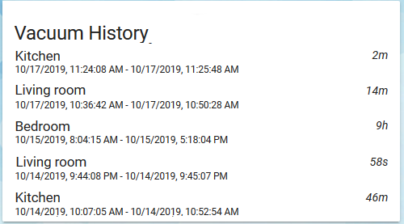
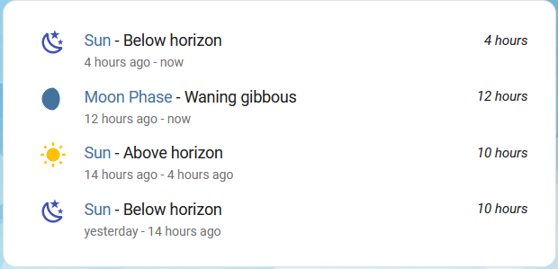
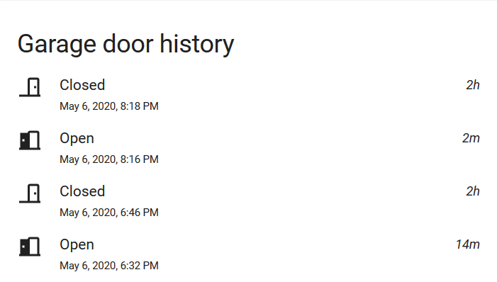
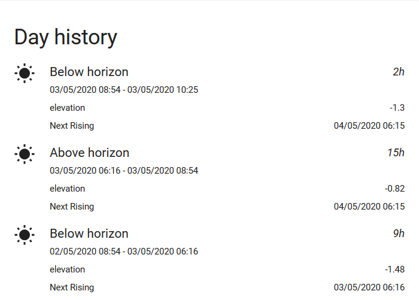
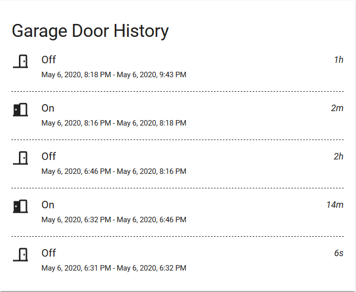
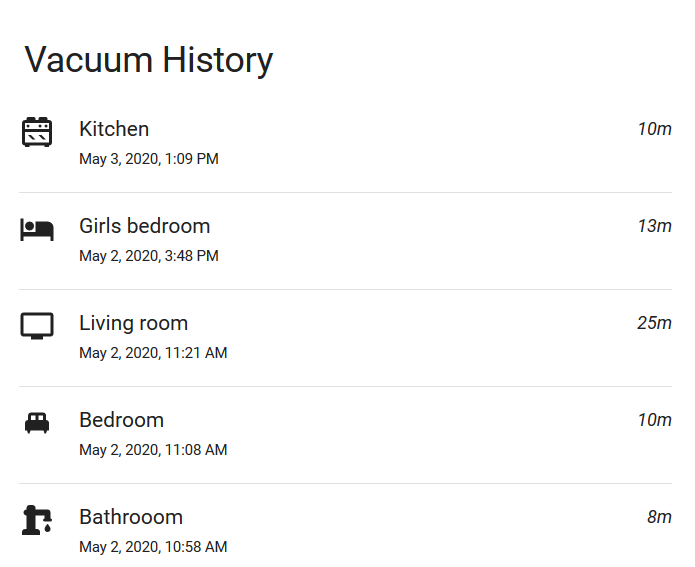
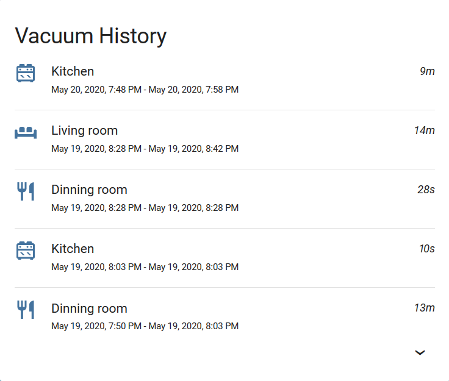

# Logbook card

[![hacs][hacs-badge]][hacs-url]
[![release][release-badge]][release-url]
![downloads][downloads-badge]

<a href="https://www.buymeacoffee.com/royto" target="_blank"></a>

2 customs [Lovelace](https://www.home-assistant.io/lovelace/) cards for displaying history of an entity or multiple entities for [Home Assistant](https://www.home-assistant.io/).



**WARNING**: Since 1.0.0, the resource type of the card is `JavaScript Module` and not `JavaScript File` anymore. In case of loading error, check if the resource type is `JavaScript module`.

## Installation

### HACS

This card is available in [HACS](https://hacs.xyz/) (Home Assistant Community Store).

### Manual

Download the logbook-card.js from the latest release and store it in your configuration/www folder.
Configure Lovelace to load the card:

```yaml
resources:
  - url: /local/logbook-card.js?v=1
    type: module
```

## Using the card

### Options

#### Logbook Card options

| Name              | Type                                                      | Required     | Since   | Deprecated | Default                                                                                                                   | Description                                                                                                                                  |  |
|-------------------|-----------------------------------------------------------|--------------|---------|------------|---------------------------------------------------------------------------------------------------------------------------|----------------------------------------------------------------------------------------------------------------------------------------------|--|
| type              | string                                                    | **required** | v0.1    |            | `custom:logbook-card`                                                                                                     |                                                                                                                                              |  |
| entity            | string                                                    | **required** | v0.1    |            | An entity_id.                                                                                                             |                                                                                                                                              |  |
| title             | string                                                    | optional     | v0.1    |            | _friendly_name_ History                                                                                                   | Card title                                                                                                                                   |  |
| history           | integer                                                   | optional     | v0.1    |            | 5                                                                                                                         | Numbers of days of history of the logbook                                                                                                    |  |
| hidden_state      | string[] or [hidden config object](#hidden-config-object) | optional     | v1.6.0  |            | []                                                                                                                        | Hide logbook entry based on state and/or attribute. string value represent the state (wildcards are supported)                               |  |
| desc              | bool                                                      | optional     | v0.1    |            | True                                                                                                                      | is logbook ordered descending                                                                                                                |  |
| no_event          | string                                                    | optional     | v0.1    |            | No event on the period                                                                                                    | message displayed if no event to display                                                                                                     |  |
| max_items         | integer                                                   | optional     | v0.2    |            | -1                                                                                                                        | Number of items to display. Ignored if < 0                                                                                                   |  |
| state_map         | [state map object](#state-map-object)                     | optional     | v0.2    |            | []                                                                                                                        | List of entity states to convert                                                                                                             |  |
| show              | list                                                      | optional     | v0.2    |            |                                                                                                                           | List of UI elements to display/hide, for available items see available [show options](#available-show-options).                              |  |
| attributes        | [attributes object](#attribute-object)                    | optional     | v0.4    |            | []                                                                                                                        | List of attributes to display.                                                                                                               |  |
| duration_labels   | [duration_labels object](#until-v141)                     | optional     | v0.5    | v1.5.0     |                                                                                                                           | labels for duration.                                                                                                                         |  |
| date_format       | string or `relative`                                      | optional     | v1.0    |            | default date time format                                                                                                  | see [fecha formatting token](https://github.com/taylorhakes/fecha#formatting-tokens). Use `relative` to have relative time like `2 days ago` |  |
| separator_style   | [separator_style object](#separator-style-object)         | optional     | v1.0    |            |                                                                                                                           | see style for separator (if activated)                                                                                                       |  |
| collapse          | number                                                    | optional     | v1.2    |            |                                                                                                                           | Number of entities to show. Rest will be available in expandable section                                                                     |  |
| custom_logs       | boolean                                                   | optional     | v1.13.0 |            | false                                                                                                                     | display custom logs sent by `logbook.log` service                                                                                            |  |
| duration          | [duration object](#duration-object)                       | optional     | v1.5.0  |            |                                                                                                                           | duration configuration                                                                                                                       |  |
| scroll            | boolean                                                   | optional     | v1.9.0  |            | true                                                                                                                      | set a max height for card and use scrollbar                                                                                                  |  |
| tap_action        | [action object](#action-options)                          | optional     | v1.7.0  |            | action: more-info                                                                                                         | Action to take on tap                                                                                                                        |  |
| hold_action       | [action object](#action-options)                          | optional     | v1.7.0  |            | none                                                                                                                      | Action to take on hold                                                                                                                       |  |
| double_tap_action | [action object](#action-options)                          | optional     | v1.7.0  |            | none                                                                                                                      | Action to take on double tap                                                                                                                 |  |
| minimal_duration  | number (in seconds)                                       | optional     | v1.11.0 |            | Filter entry if duration is less than `minimal_duration` (entry will be squash if previous and next entry has same state) |                                                                                                                                              |  |

#### Multiple entities Logbook Card options

the `custom:multiple-logbook-card` card has been introduce in v2.0.0.

| Name              | Type                                              | Required     | Since  | Deprecated | Default                        | Description                                                                                                                                  |
|-------------------|---------------------------------------------------|--------------|--------|------------|--------------------------------|----------------------------------------------------------------------------------------------------------------------------------------------|
| type              | string                                            | **required** | v2.0.0 |            | `custom:multiple-logbook-card` |                                                                                                                                              |
| entities          | [entity config object](#entity-object)            | **required** | v2.0.0 |            |                                | List of entities with its configuration.                                                                                                     |
| title             | string                                            | optional     | v2.0.0 |            |                                | Card title. Hidden if empty                                                                                                                  |
| history           | integer                                           | optional     | v2.0.0 |            | 5                              | Numbers of days of history of the logbook                                                                                                    |
| desc              | bool                                              | optional     | v2.0.0 |            | True                           | is logbook ordered descending                                                                                                                |
| no_event          | string                                            | optional     | v2.0.0 |            | No event on the period         | message displayed if no event to display                                                                                                     |
| max_items         | integer                                           | optional     | v2.0.0 |            | -1                             | Number of items to display. Ignored if < 0                                                                                                   |
| show              | list                                              | optional     | v2.0.0 |            |                                | List of UI elements to display/hide, for available items see available [show options](#available-show-options).                              |
| duration_labels   | [duration_labels object](#until-v141)             | optional     | v2.0.0 |            |                                | labels for duration.                                                                                                                         |
| date_format       | string or `relative`                              | optional     | v2.0.0 |            | default date time format       | see [fecha formatting token](https://github.com/taylorhakes/fecha#formatting-tokens). Use `relative` to have relative time like `2 days ago` |
| separator_style   | [separator_style object](#separator-style-object) | optional     | v2.0.0 |            |                                | see style for separator (if activated)                                                                                                       |
| collapse          | number                                            | optional     | v2.0.0 |            |                                | Number of entities to show. Rest will be available in expandable section                                                                     |
| duration          | [duration object](#duration-object)               | optional     | v2.0.0 |            | duration configuration         |                                                                                                                                              |
| scroll            | boolean                                           | optional     | v2.0.0 |            | true                           | set a max height for card and use scrollbar                                                                                                  |
| tap_action        | [action object](#action-options)                  | optional     | v2.0.0 |            | action: more-info              | Action to take on tap                                                                                                                        |
| hold_action       | [action object](#action-options)                  | optional     | v2.0.0 |            | none                           | Action to take on hold                                                                                                                       |
| double_tap_action | [action object](#action-options)                  | optional     | v2.0.0 |            | none                           | Action to take on double tap                                                                                                                 |
| minimal_duration  | number (in seconds)                               | optional     | v2.0.0 |            |                                | Filter entry if duration is less than `minimal_duration` (entry will be squash if previous and next entry has same state)                    |

#### Entity object

| Name         | Type                                                      | Required     | Since   | Deprecated | Default | Description                                                                                                    |
|--------------|-----------------------------------------------------------|--------------|---------|------------|---------|----------------------------------------------------------------------------------------------------------------|
| entity       | string                                                    | **required** | v2.0    |            |         | Name of the entity                                                                                             |
| attributes   | [attributes object](#attribute-object)                    | optional     | v2.0    |            | []      | List of attributes to display.                                                                                 |
| hidden_state | string[] or [hidden config object](#hidden-config-object) | optional     | v2.0    |            | []      | Hide logbook entry based on state and/or attribute. string value represent the state (wildcards are supported) |
| custom_logs  | boolean                                                   | optional     | v2.0    |            | false   | display custom logs sent by `logbook.log` service                                                              |
| state_map    | [state map object](#state-map-object)                     | optional     | v2.0    |            | []      | List of entity states to convert                                                                               |

#### State map object

| Name                   |  Type  |      Default       | Description                             | Since  |
| ---------------------- | :----: | :----------------: | --------------------------------------- | ------ |
| value **_(required)_** | string |                    | Value to convert. wildcard is supported |        |
| label                  | string |   same as value    | String to show as label.                |        |
| icon                   | string | default state icon | Icon to show.                           |        |
| icon_color             | string |                    | icon color for this state.              | v1.6.0 |

If you use wildcard, make sure to put the more specific states first.

#### Available show options

All properties are optional.

| Name       | Default |     Options      | Description        |
| ---------- | :-----: | :--------------: | ------------------ |
| state      | `true`  | `true` / `false` | Display state      |
| duration   | `true`  | `true` / `false` | Display duration   |
| start_date | `true`  | `true` / `false` | Display start date |
| end_date   | `true`  | `true` / `false` | Display end date   |
| icon       | `true`  | `true` / `false` | Display icon       |
| separator  | `false` | `true` / `false` | Display separator  |

#### Attribute object

| Name                   |  Type  |    Default    | Description                                                             |
| ---------------------- | :----: | :-----------: | ----------------------------------------------------------------------- |
| value **_(required)_** | string |               | name of the attributes.                                                 |
| label                  | string | same as value | String to show as label.                                                |
| type                   | string |    string     | Type of the value used for formatting. Only date is currently supported |

#### Duration object

| Name      |  Type        |        Default          | Description                                                                                                                                     |
| --------- | :----------: | :---------------------: | ----------------------------------------------------------------------------------------------------------------------------------------------- |
| largest   | number       |          `1`            | Number representing the maximum number of units to display for the duration. Use `full` for no limitation                                       |
| labels    | [duration labels object](#from-v150) | | [Style](https://developer.mozilla.org/en-US/docs/Web/CSS/border-style) of the separator.                                                        |
| units     | string array |                         | Array of strings to define which units are used to display the duration (if needed). Allowed values: ['y', 'mo', 'w', 'd', 'h', 'm', 's', 'ms'] |
| delimiter | string       |                         | String to display between the previous unit and the next value.                                                                                 |

#### Duration labels object

##### Until v1.4.1

This configuration is _Deprecated since v.1.5.0_.

Allows to have custom labels for duration. Must contains `${value}` which will be replaced by the duration.

| Name    |  Type  |   Default   | Description        |
| ------- | :----: | :---------: | ------------------ |
| second  | string | `${value}s` | label for second.  |
| seconds | string | `${value}s` | label for seconds. |
| minute  | string | `${value}m` | label for minute.  |
| minutes | string | `${value}m` | label for minutes. |
| hour    | string | `${value}h` | label for hour.    |
| hours   | string | `${value}h` | label for hours.   |
| day     | string | `${value}d` | label for day.     |
| days    | string | `${value}d` | label for days.    |

##### FROM v1.5.0

Allows to have custom labels for duration.

| Name    |  Type  |   Default   | Description        |
| ------- | :----: | :---------: | ------------------ |
| second  | string | `s`         | label for second.  |
| minute  | string | `m`         | label for minute.  |
| hour    | string | `h`         | label for hour.    |
| day     | string | `d`         | label for day.     |
| week    | string | `w`         | label for week.    |
| month   | string | `m`         | label for month.   |

#### Hidden config object

Introduce in 1.10.0

| Name      |  Type                                                             |   Default   | Description        |
| -------   | :---------------------------------------------------------------: | :---------: | ------------------ |
| state     | string                                                            |             | state to hide.     |
| attribute | [Attribute hidden config object](#attribute-hidden-config-object) |             | label for minute.  |

#### Attribute hidden config object

Introduce in 1.10.0

| Name                   |  Type    |   Default   | Description                                       |
| ---------------------- | :------: | :---------: | ------------------------------------------------- |
| name **_(required)_**  | string   |             | the name of the attribute                         |
| value **_(required)_** | string   |             | the value of the attribute. wildcard is supported |
| hideIfMissing          | boolean  | false       | hidden if attribute is not set.                   |

#### Separator style object

| Name  |  Type  |        Default         | Description                                                                              |
| ----- | :----: | :--------------------: | ---------------------------------------------------------------------------------------- |
| width | number |          `1`           | Width of the separator.                                                                  |
| style | string |        `solid`         | [Style](https://developer.mozilla.org/en-US/docs/Web/CSS/border-style) of the separator. |
| color | string | `var(--divider-color)` | Color of the separator.                                                                  |

## Action Options

| Name            | Type   | Requirement  | Description                                                                                                                            | Default     |
| --------------- | ------ | ------------ | -------------------------------------------------------------------------------------------------------------------------------------- | ----------- |
| action          | string | **Required** | Action to perform (more-info, toggle, call-service, navigate url, none)                                                                | `more-info` |
| navigation_path | string | **Optional** | Path to navigate to (e.g. /lovelace/0/) when action defined as navigate                                                                | `none`      |
| url             | string | **Optional** | URL to open on click when action is url. The URL will open in a new tab                                                                | `none`      |
| service         | string | **Optional** | Service to call (e.g. media_player.media_play_pause) when action defined as call-service                                               | `none`      |
| service_data    | object | **Optional** | Service data to include (e.g. entity_id: media_player.bedroom) when action defined as call-service                                     | `none`      |
| haptic          | string | **Optional** | Haptic feedback _success, warning, failure, light, medium, heavy, selection_ | `none`      |
| repeat          | number | **Optional** | How often to repeat the `hold_action` in milliseconds.                                                                                 | `none`       |

### Example usage

Example with hidden states

```yaml
type: 'custom:logbook-card'
desc: true
entity: sun.sun
hidden_state:
  - above_horizon
title: Day history
```

Example with multiple entities

```yaml
type: 'custom:multiple-logbook-card'
desc: true
entities: 
  - entity: sun.sun
    hidden_state:
      - above_horizon
  - entity: sensor.moon_phase
title: Sun And Moon
```



Example with state label

```yaml
entity: binary_sensor.garage_opening_sensor
max_items: 10
state_map:
  - label: Open
    value: on
  - label: Closed
    value: off
title: 'Garage door history'
type: 'custom:logbook-card'
show:
  end_date: false
  start_date: true
```



Example with attributes and custom date format

```yaml
type: 'custom:logbook-card'
desc: true
entity: sun.sun
title: Day history
attributes:
  - value: elevation
  - value: next_rising
    label: Next Rising
    type: date
date_format: dd/MM/YYYY hh:mm
```



Example with short duration labels:

```yaml
type: 'custom:logbook-card'
desc: true
entity: binary_sensor.garage_opening_sensor
title: 'Garage'
duration:
  labels:
    second: 's'
    minute: 'm'
    hour: 'h'
    day: 'j'
    week: 'w'
    month: 'm'
```

Example with custom separator style:

```yaml
type: 'custom:logbook-card'
desc: true
entity: binary_sensor.garage_opening_sensor
title: 'Garage Door History'
show:
  separator: true
separator_style:
  color: black
  style: dashed
```



Example with custom icons:

```yaml
entity: sensor.vacuum
hidden_state:
  - ''
state_map:
  - icon: 'mdi:stove'
    value: Kitchen
  - icon: 'mdi:hotel'
    value: Girls bedroom
  - icon: 'mdi:bed-double'
    value: Bedroom
  - icon: 'mdi:water-pump'
    value: Bathroom
  - icon: 'mdi:television'
    value: Living room
title: Vacuum History
type: 'custom:logbook-card'
```



Example with collapsed view:

```yaml
entity: sensor.vacuum
hidden_state:
  - ''
collapse: 5
title: Vacuum History
type: 'custom:logbook-card'
```



<!-- Badges -->

[hacs-url]: https://github.com/hacs/integration
[hacs-badge]: https://img.shields.io/badge/hacs-default-orange.svg?style=flat-square
[release-badge]: https://img.shields.io/github/v/release/royto/logbook-card?style=flat-square
[downloads-badge]: https://img.shields.io/github/downloads/royto/logbook-card/total?style=flat-square
[release-url]: https://github.com/royto/logbook-card/releases
